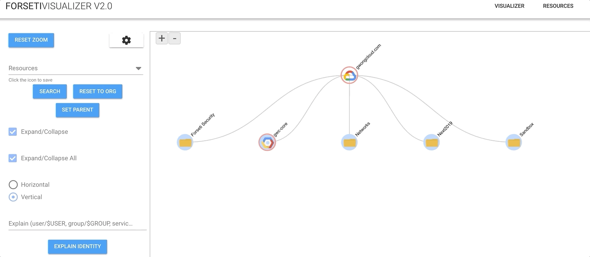

# Forseti Visualizer



Forseti Visualizer provides a visualization solution, based on [Forseti Security's](https://github.com/forseti-security/forseti-security) Inventorying and Violation modules.  Forseti Visualizer attempts to enable Google Cloud Platform users to better understand their GCP Organization Structure, while providing insights into policy adherence through identification of violations.

## Overview

This solution contains a frontend (forseti-visualizer-ui) and backend (forseti-api) component.  The frontend defaults to running on port 8081, while the backend runs on port 8080.  

### Frontend (forseti-visualizer-ui)

Written in:

* [node.js v10.0.0+](https://nodejs.org/en/)
* [vue-cli](https://cli.vuejs.org/guide/installation.html)
* [d3v5](https://d3js.org/)

### Backend (forseti-api)

Written in:

* [express.js v4.16.1+](https://expressjs.com/)

## Getting Started (Local Deployment)

The full local deployment consists of *3 discrete steps* (visualizer-ui, cloud-sql-proxy, and the api).  In the end, the *api folder* acts as the bundled code base and the application should be served from this folder.

### forseti-visualizer-ui

Navigate to the forseti-visualizer-ui/ directory, install npm packages.

```bash
cd forseti-visualizer-ui/

# install the packages
npm install

# if any vulnerabilities from JS package versions, then run
npm audit fix

# build the application (FYI: This also copies to dist to the ../forseti-api/ folder)
npm run build

# NOTE: IF you are developing JUST the UI, you can run `npm start`.  In this case, the app is served on PORT 8081, and not PORT 8080.
```

### cloud-sql-proxy

Navigate to the tools/ directory.  Cloud SQL Proxy enables connectivity to Cloud SQL (mysql) Database.

```bash
# install the `cloud_sql_proxy` for your BUILD ENVIRONMENT [Reference](https://cloud.google.com/sql/docs/mysql/sql-proxy)
wget https://dl.google.com/cloudsql/cloud_sql_proxy.linux.amd64 -O cloud_sql_proxy
# curl -o cloud_sql_proxy https://dl.google.com/cloudsql/cloud_sql_proxy.darwin.amd64

# ensure `cloud_sql_proxy` is executable 
chmod +x cloud_sql_proxy

# run cloud_sql_proxy in the BACKGROUND (there are sample scripts for reference)
./cloud_sql_proxy -instances=$CLOUDSQL_INSTANCE_CONNECTION_NAME=tcp:3306 &
```

### forseti-api

Navigate to forseti-api/.  Create a `source.env` file, which will should be sourced to set the appropriate ENV variables prior to runtime.  You will need to populate the fields below.  The HANDLE and CHANNEL are leveraged for the IAM Explain functionality.

```bash
# navigate to forseti-api
cd forseti-api/

# create source.env file.  Replace the variable values with the correct values.  
# You _may_ need to change `CLOUDSQL_PASSWORD` and `PROJECT_ID`, but most other values can stay the same.
# `FORSETI_SERVER_VM_CHANNEL` and `FORSETI_DATA_MODEL_HANDLE` are OPTIONAL and only used for IAM Explain Functionality.
cat > source.env << EOF
export API_HOST="0.0.0.0"
export API_PORT="8080"
export CLOUDSQL_HOSTNAME="127.0.0.1"
export CLOUDSQL_USERNAME="root"
export CLOUDSQL_PASSWORD=""
export CLOUDSQL_SCHEMA="forseti_security"
export FORSETI_SERVER_VM_CHANNEL="0.0.0.0:50051"
export FORSETI_DATA_MODEL_HANDLE="21254f1de747879237a95cb552e80844"
export PROJECT_ID="forseti-visualizer"
EOF

# install npm packages
npm install

# if any vulnerabilities from JS package versions, then run
npm audit fix

# source environment variables
source source.env

# run the app: the APP can be accessed on PORT 8080 (example: http://localhost:8080/)
npm start
```

## Alternative Deployments

There are other solution deployment pipelines described here for Docker, GCE, GKE and Cloud Run.  Each of these are dependent on a Docker Image of Forseti Visualizer.  

### Docker

```bash
cd infrastructure/

# copy the source.env file from forseti-api/ (refer to the Local Deployment section)
cp ../forseti-api/source.env source.env

# run the Build Images script to build a docker image
./build-images.sh

# verify that the docker image has been built
docker images | grep 

# verify that the docker image can be run
cat > dockersource.env << EOF
API_HOST=0.0.0.0
API_PORT=8080
CLOUDSQL_HOSTNAME=127.0.0.1
CLOUDSQL_USERNAME=root
CLOUDSQL_PASSWORD=
CLOUDSQL_SCHEMA=forseti_security
FORSETI_SERVER_VM_CHANNEL=0.0.0.0:50051
FORSETI_DATA_MODEL_HANDLE=21254f1de747879237a95cb552e80844
PROJECT_ID=forseti-visualizer
EOF

PROJECT_ID="forseti-visualizer" # << REPLACE THIS WITH YOUR PROJECT_ID
IMAGE_NAME="forseti-visualizer"
FULL_IAMGE_NAME="gcr.io/$PROJECT_ID/$IMAGE_NAME"

docker run --env-file dockersource.env --name forsetivisualizer --rm -d -p 8080:8080 $FULL_IAMGE_NAME
docker ps

# navigate to http://localhost:8080/

# when finished, kill the docker image process
docker kill $(docker inspect --format="{{.Id}}" forsetivisualizer)
docker ps
```

### GCE

```bash
./deployments/deploy-gce.sh
```

### GKE

```bash
./deployments/deploy-gke.sh
```

### Cloud Run

```bash 
./deployments/deploy-cloudrun.sh
```

## References

* [Google Cloud Blog](https://cloud.google.com/blog/products/identity-security/understand-gcp-organization-resource-hierarchies-with-forseti-visualizer)
* [Medium](https://medium.com/google-cloud/visualize-gcp-architecture-using-forseti-2-0-and-d3-js-ffc8fdf59450)
